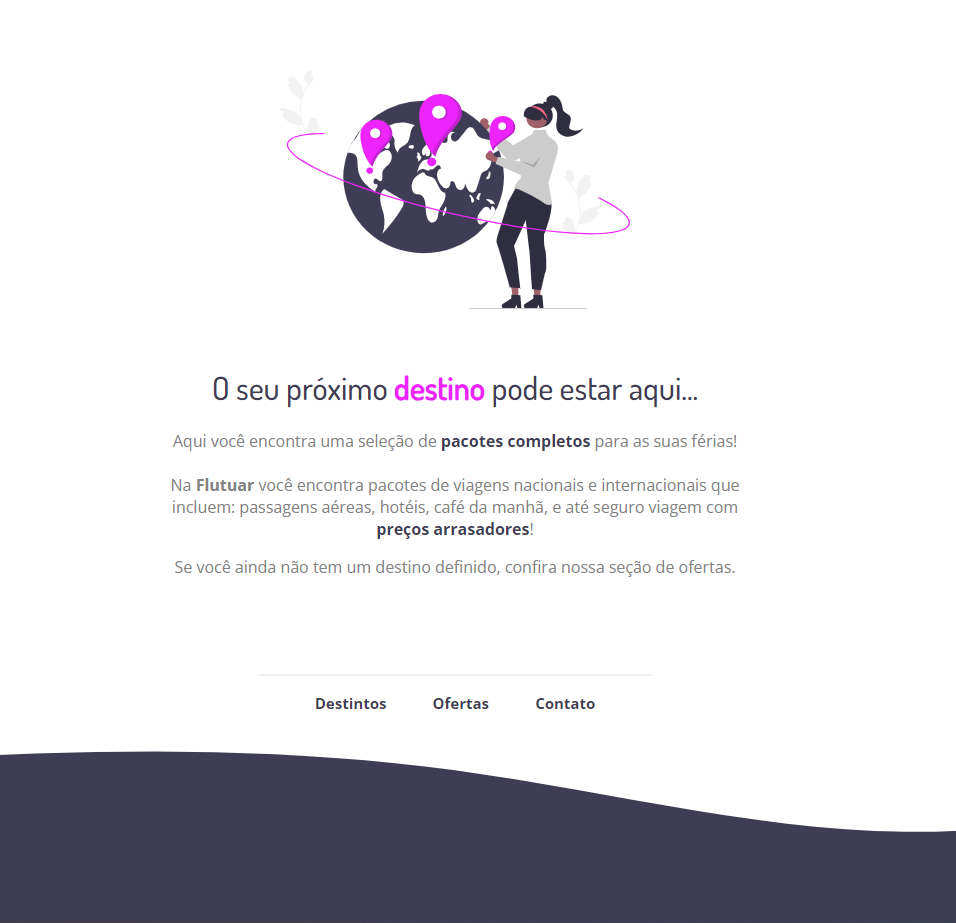

<h1 align="center">Projeto Desafio Recriando layout
</h1>

## 🚀 Tecnologias

Esse projeto foi desenvolvido com as seguintes tecnologias:

- HTML
- CSS

## PRINCIPAL APRENDIZADO
reformular os conhecimentos basicos de html e css 

## sobre
projeto desenvolvido no explorer da rocketseat

## 💻 Projeto Fotos

 

